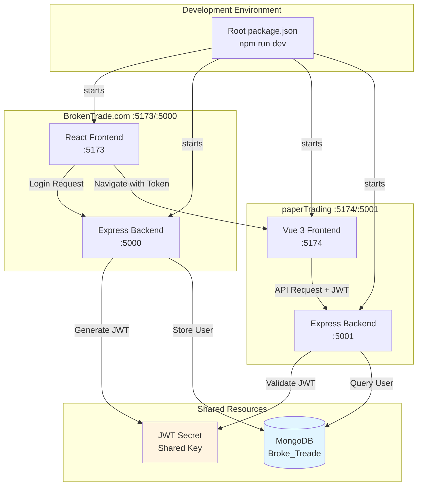
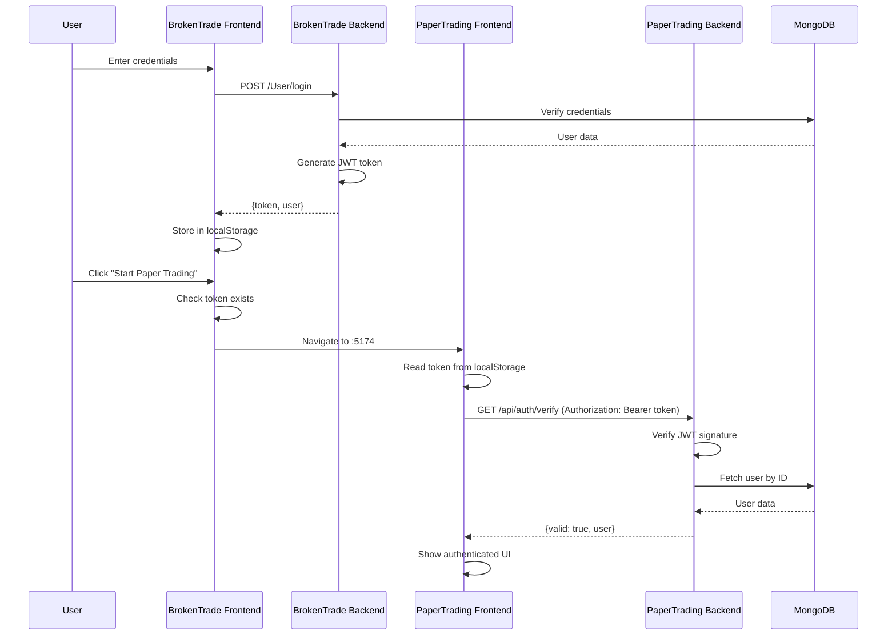
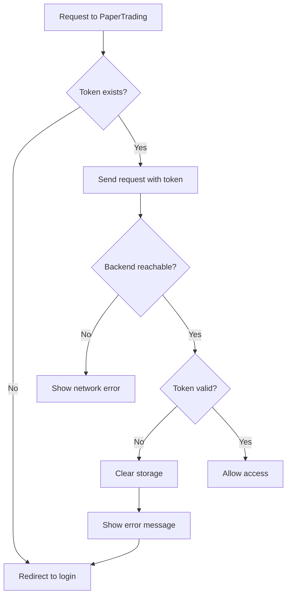

# Design Document: Paper Trading Integration

## Overview

This design document specifies the technical architecture for integrating the BrokenTrade.com educational platform with the paperTrading algorithmic trading feature. The integration transforms two independent applications into a unified platform with shared authentication, database, and development environment.

### Goals

- Unify development workflow with single-command startup
- Implement JWT-based shared authentication between both platforms
- Share MongoDB database for user data consistency
- Enable seamless navigation from BrokenTrade.com to paperTrading
- Ensure paperTrading functions as a dependent feature module of BrokenTrade.com

### Non-Goals

- Migrating existing paperTrading users (fresh integration)
- Supporting independent paperTrading deployment
- Implementing OAuth or third-party authentication
- Real-time session synchronization across tabs

## Architecture

### System Architecture



### Authentication Flow



## Components and Interfaces

### 1. Root Monorepo Configuration

**File: `package.json` (workspace root)**

```json
{
  "name": "brokentrade-monorepo",
  "version": "1.0.0",
  "private": true,
  "scripts": {
    "dev": "concurrently \"npm run dev:bt-backend\" \"npm run dev:bt-frontend\" \"npm run dev:pt-backend\" \"npm run dev:pt-frontend\"",
    "dev:bt-backend": "cd BrokenTrade.com/backend && npm run dev",
    "dev:bt-frontend": "cd BrokenTrade.com/frontend && npm run dev",
    "dev:pt-backend": "cd paperTrading/backend && npm run dev",
    "dev:pt-frontend": "cd paperTrading/frontend && npm run dev"
  },
  "devDependencies": {
    "concurrently": "^9.1.2"
  }
}
```

**File: `.env` (workspace root)**

```env
# Shared Configuration
MONGODB_URI=mongodb://localhost:27017/Broke_Treade
JWT_SECRET=your-super-secret-jwt-key-change-in-production
JWT_EXPIRES_IN=24h

# Service Ports
BT_BACKEND_PORT=5000
BT_FRONTEND_PORT=5173
PT_BACKEND_PORT=5001
PT_FRONTEND_PORT=5174

# CORS Origins
BT_FRONTEND_URL=http://localhost:5173
PT_FRONTEND_URL=http://localhost:5174
```

### 2. BrokenTrade Backend Authentication Enhancement

**File: `BrokenTrade.com/backend/src/routes/userRoutes.js`**

Add JWT generation to login endpoint:

```javascript
const jwt = require('jsonwebtoken');

router.post('/login', async (req, res) => {
    try {
        const { email, password } = req.body;
        
        const user = await User.findOne({ email });
        if (!user) {
            return res.status(401).json({ error: 'Invalid email or password' });
        }
        
        const isMatch = await bcrypt.compare(password, user.password);
        if (!isMatch) {
            return res.status(401).json({ error: 'Invalid email or password' });
        }
        
        // Generate JWT token
        const token = jwt.sign(
            { 
                id: user._id, 
                email: user.email,
                type: user.type 
            },
            process.env.JWT_SECRET,
            { expiresIn: process.env.JWT_EXPIRES_IN || '24h' }
        );
        
        res.status(200).json({
            message: 'Login successful',
            token,
            user: {
                id: user._id,
                name: user.name,
                email: user.email,
                type: user.type,
            },
        });
    } catch (err) {
        console.log(err);
        res.status(500).json({ error: 'Internal Server Error' });
    }
});
```

**File: `BrokenTrade.com/backend/package.json`**

Add jsonwebtoken dependency:

```json
{
  "dependencies": {
    "bcryptjs": "^3.0.3",
    "cors": "^2.8.6",
    "dotenv": "^17.4.1",
    "express": "^5.2.1",
    "jsonwebtoken": "^9.0.2",
    "mongoose": "^9.4.1",
    "multer": "^2.1.1"
  }
}
```

**File: `BrokenTrade.com/backend/server.js`**

Update CORS configuration:

```javascript
app.use(cors({
  origin: [
    process.env.BT_FRONTEND_URL || 'http://localhost:5173',
    process.env.PT_FRONTEND_URL || 'http://localhost:5174'
  ],
  credentials: true,
}));
```

**File: `BrokenTrade.com/backend/.env`**

```env
PORT=5000
MONGODB_URI=mongodb://localhost:27017/Broke_Treade
JWT_SECRET=your-super-secret-jwt-key-change-in-production
JWT_EXPIRES_IN=24h
BT_FRONTEND_URL=http://localhost:5173
PT_FRONTEND_URL=http://localhost:5174
```

### 3. BrokenTrade Frontend Authentication Update

**File: `BrokenTrade.com/frontend/src/context/AuthContext.jsx`**

```javascript
import { createContext, useContext, useState, useEffect } from 'react';

const AuthContext = createContext(null);

export function AuthProvider({ children }) {
  const [user, setUser] = useState(null);
  const [token, setToken] = useState(null);
  const [loading, setLoading] = useState(true);

  useEffect(() => {
    try {
      const storedUser = localStorage.getItem('brokentrade_user');
      const storedToken = localStorage.getItem('brokentrade_token');
      
      if (storedUser && storedToken) {
        setUser(JSON.parse(storedUser));
        setToken(storedToken);
      }
    } catch (e) {
      localStorage.removeItem('brokentrade_user');
      localStorage.removeItem('brokentrade_token');
    }
    setLoading(false);
  }, []);

  const login = (userData, authToken) => {
    setUser(userData);
    setToken(authToken);
    localStorage.setItem('brokentrade_user', JSON.stringify(userData));
    localStorage.setItem('brokentrade_token', authToken);
  };

  const logout = () => {
    setUser(null);
    setToken(null);
    localStorage.removeItem('brokentrade_user');
    localStorage.removeItem('brokentrade_token');
  };

  const navigateToPaperTrading = () => {
    if (!token) {
      return { success: false, message: 'Please log in to access Paper Trading.' };
    }
    window.location.href = 'http://localhost:5174';
    return { success: true };
  };

  return (
    <AuthContext.Provider value={{ user, token, login, logout, loading, navigateToPaperTrading }}>
      {children}
    </AuthContext.Provider>
  );
}

export function useAuth() {
  const context = useContext(AuthContext);
  if (!context) {
    throw new Error('useAuth must be used within an AuthProvider');
  }
  return context;
}
```

**File: `BrokenTrade.com/frontend/src/pages/Login.jsx`** (update login handler)

```javascript
const handleLogin = async (e) => {
  e.preventDefault();
  try {
    const response = await fetch('http://localhost:5000/User/login', {
      method: 'POST',
      headers: { 'Content-Type': 'application/json' },
      body: JSON.stringify({ email, password }),
    });
    
    const data = await response.json();
    
    if (response.ok) {
      login(data.user, data.token); // Pass both user and token
      navigate('/');
    } else {
      setError(data.error || 'Login failed');
    }
  } catch (err) {
    setError('Network error. Please try again.');
  }
};
```

**New File: `BrokenTrade.com/frontend/src/components/PaperTradingButton.jsx`**

```javascript
import { useAuth } from '../context/AuthContext';
import { useState } from 'react';

export function PaperTradingButton() {
  const { navigateToPaperTrading, user } = useAuth();
  const [error, setError] = useState('');

  const handleClick = () => {
    const result = navigateToPaperTrading();
    if (!result.success) {
      setError(result.message);
    }
  };

  return (
    <div>
      <button 
        onClick={handleClick}
        className="paper-trading-btn"
      >
        Start Paper Trading
      </button>
      {error && <p className="error-message">{error}</p>}
    </div>
  );
}
```

### 4. PaperTrading Backend Authentication Integration

**File: `paperTrading/backend/src/middleware/authMiddleware.js`** (new file)

```javascript
import jwt from 'jsonwebtoken';
import mongoose from 'mongoose';

const User = mongoose.model('User', new mongoose.Schema({
  name: String,
  email: { type: String, unique: true },
  mobile: String,
  pan: String,
  dob: Date,
  password: String,
  type: { type: String, enum: ['Learner', 'Instructor', 'Broker', 'Admin'] },
  createdAt: { type: Date, default: Date.now },
  coins: { type: Number, default: 100000 },
  gig: String,
  rating: Number,
  image: String,
  description: String,
  title: String,
}));

export async function authenticateToken(req, res, next) {
  const authHeader = req.headers['authorization'];
  const token = authHeader && authHeader.split(' ')[1]; // Bearer TOKEN

  if (!token) {
    return res.status(401).json({
      error: {
        code: 'MISSING_TOKEN',
        message: 'Authentication token is required',
      },
    });
  }

  try {
    const decoded = jwt.verify(token, process.env.JWT_SECRET);
    
    // Fetch user from shared database
    const user = await User.findById(decoded.id).select('-password');
    
    if (!user) {
      return res.status(401).json({
        error: {
          code: 'USER_NOT_FOUND',
          message: 'User account not found',
        },
      });
    }

    req.user = user;
    next();
  } catch (err) {
    if (err.name === 'TokenExpiredError') {
      return res.status(401).json({
        error: {
          code: 'TOKEN_EXPIRED',
          message: 'Your session has expired. Please log in again.',
        },
      });
    }
    
    if (err.name === 'JsonWebTokenError') {
      return res.status(401).json({
        error: {
          code: 'INVALID_TOKEN',
          message: 'Invalid authentication token',
        },
      });
    }

    return res.status(500).json({
      error: {
        code: 'AUTH_ERROR',
        message: 'Authentication failed',
      },
    });
  }
}
```

**File: `paperTrading/backend/src/routes/authRoutes.js`** (new file)

```javascript
import express from 'express';
import { authenticateToken } from '../middleware/authMiddleware.js';

const router = express.Router();

router.get('/verify', authenticateToken, (req, res) => {
  res.json({
    valid: true,
    user: {
      id: req.user._id,
      name: req.user.name,
      email: req.user.email,
      type: req.user.type,
      coins: req.user.coins,
    },
  });
});

router.get('/health', (req, res) => {
  res.json({ 
    status: 'ok',
    message: 'PaperTrading backend is running',
    requiresAuth: true 
  });
});

export default router;
```

**File: `paperTrading/backend/src/app.js`** (update)

```javascript
import cors from "express";
import express from "express";

import authRoutes from "./routes/authRoutes.js";
import { authenticateToken } from "./middleware/authMiddleware.js";
// ... other imports

const app = express();

app.use(
  cors({
    origin: [
      process.env.BT_FRONTEND_URL || "http://localhost:5173",
      process.env.PT_FRONTEND_URL || "http://localhost:5174"
    ],
    credentials: true,
  }),
);
app.use(express.json({ limit: "1mb" }));

// Public routes
app.get("/health", (_req, res) => {
  res.json({ status: "ok" });
});

app.use("/api/auth", authRoutes);

// Protected routes - require authentication
app.use("/api/data-accessor", authenticateToken, marketRoutes);
app.use("/api/indicator-api", authenticateToken, indicatorRoutes);
app.use("/api", authenticateToken, tradingRoutes);

// ... error handlers
```

**File: `paperTrading/backend/.env`**

```env
PORT=5001
NODE_ENV=development
MONGODB_URI=mongodb://localhost:27017/Broke_Treade
JWT_SECRET=your-super-secret-jwt-key-change-in-production
JWT_EXPIRES_IN=24h
BT_FRONTEND_URL=http://localhost:5173
PT_FRONTEND_URL=http://localhost:5174
```

**File: `paperTrading/backend/src/services/dbService.js`** (update)

```javascript
import mongoose from "mongoose";

export async function connectDatabase() {
  const mongoUri = process.env.MONGODB_URI;

  if (!mongoUri) {
    throw new Error("MONGODB_URI is required to connect to MongoDB.");
  }

  if (mongoose.connection.readyState === 1) {
    return mongoose.connection;
  }

  mongoose.set("strictQuery", true);

  // Connect without specifying dbName - use the database in the URI
  await mongoose.connect(mongoUri, {
    serverSelectionTimeoutMS: Number(process.env.MONGODB_TIMEOUT_MS || 10000),
  });

  console.log(`MongoDB connected: ${mongoose.connection.name}`);
  return mongoose.connection;
}

// ... rest of the file
```

### 5. PaperTrading Frontend Authentication Integration

**File: `paperTrading/frontend/src/stores/auth.js`** (new file using Pinia)

```javascript
import { defineStore } from 'pinia';
import { ref, computed } from 'vue';

export const useAuthStore = defineStore('auth', () => {
  const user = ref(null);
  const token = ref(null);
  const loading = ref(true);
  const error = ref('');

  const isAuthenticated = computed(() => !!token.value);

  function loadFromStorage() {
    try {
      const storedToken = localStorage.getItem('brokentrade_token');
      const storedUser = localStorage.getItem('brokentrade_user');
      
      if (storedToken && storedUser) {
        token.value = storedToken;
        user.value = JSON.parse(storedUser);
      }
    } catch (e) {
      console.error('Failed to load auth from storage:', e);
      clearAuth();
    } finally {
      loading.value = false;
    }
  }

  async function verifyToken() {
    if (!token.value) {
      redirectToLogin('Please log in to access Paper Trading.');
      return false;
    }

    try {
      const response = await fetch('http://localhost:5001/api/auth/verify', {
        headers: {
          'Authorization': `Bearer ${token.value}`,
        },
      });

      if (!response.ok) {
        const data = await response.json();
        throw new Error(data.error?.message || 'Token verification failed');
      }

      const data = await response.json();
      user.value = data.user;
      return true;
    } catch (err) {
      console.error('Token verification failed:', err);
      
      if (err.message.includes('expired')) {
        error.value = 'Your session has expired. Please log in again.';
      } else if (err.message.includes('connect')) {
        error.value = 'Unable to connect to the server. Please check your connection.';
      } else {
        error.value = 'Authentication failed. Please log in again.';
      }
      
      clearAuth();
      redirectToLogin(error.value);
      return false;
    }
  }

  function clearAuth() {
    user.value = null;
    token.value = null;
    localStorage.removeItem('brokentrade_token');
    localStorage.removeItem('brokentrade_user');
  }

  function logout() {
    clearAuth();
    redirectToLogin('You have been logged out.');
  }

  function redirectToLogin(message = '') {
    const url = new URL('http://localhost:5173/login');
    if (message) {
      url.searchParams.set('message', message);
    }
    window.location.href = url.toString();
  }

  function checkBackendAvailability() {
    return fetch('http://localhost:5001/api/auth/health')
      .then(res => res.ok)
      .catch(() => false);
  }

  return {
    user,
    token,
    loading,
    error,
    isAuthenticated,
    loadFromStorage,
    verifyToken,
    logout,
    checkBackendAvailability,
  };
});
```

**File: `paperTrading/frontend/src/router/index.js`** (update with auth guard)

```javascript
import { createRouter, createWebHistory } from 'vue-router';
import { useAuthStore } from '../stores/auth';

const routes = [
  {
    path: '/',
    name: 'Home',
    component: () => import('../views/Home.vue'),
    meta: { requiresAuth: true },
  },
  // ... other routes
];

const router = createRouter({
  history: createWebHistory(),
  routes,
});

router.beforeEach(async (to, from, next) => {
  const authStore = useAuthStore();

  if (to.meta.requiresAuth) {
    // Check if backend is available
    const backendAvailable = await authStore.checkBackendAvailability();
    if (!backendAvailable) {
      authStore.error = 'Main platform is not available';
      authStore.redirectToLogin('Main platform is not available');
      return;
    }

    // Verify authentication
    const isValid = await authStore.verifyToken();
    if (!isValid) {
      return; // verifyToken handles redirect
    }
  }

  next();
});

export default router;
```

**File: `paperTrading/frontend/src/main.js`** (update)

```javascript
import { createApp } from 'vue';
import { createPinia } from 'pinia';
import App from './App.vue';
import router from './router';
import { useAuthStore } from './stores/auth';

const app = createApp(App);
const pinia = createPinia();

app.use(pinia);
app.use(router);

// Initialize auth before mounting
const authStore = useAuthStore();
authStore.loadFromStorage();

app.mount('#app');
```

**File: `paperTrading/frontend/src/components/LogoutButton.vue`** (new component)

```vue
<template>
  <button @click="handleLogout" class="logout-btn">
    Logout
  </button>
</template>

<script setup>
import { useAuthStore } from '../stores/auth';

const authStore = useAuthStore();

function handleLogout() {
  authStore.logout();
}
</script>

<style scoped>
.logout-btn {
  padding: 8px 16px;
  background-color: #dc3545;
  color: white;
  border: none;
  border-radius: 4px;
  cursor: pointer;
}

.logout-btn:hover {
  background-color: #c82333;
}
</style>
```

## Data Models

### Shared User Schema

Both backends use the same MongoDB database (`Broke_Treade`) and User schema:

```javascript
{
  _id: ObjectId,
  name: String (required),
  email: String (required, unique, lowercase),
  mobile: String (required),
  pan: String (required, uppercase),
  dob: Date (required),
  password: String (required, hashed),
  type: String (enum: ['Learner', 'Instructor', 'Broker', 'Admin'], default: 'Learner'),
  createdAt: Date (default: Date.now),
  coins: Number (default: 100000),
  gig: String,
  rating: Number,
  image: String,
  description: String,
  title: String
}
```

### JWT Token Payload

```javascript
{
  id: String (user._id),
  email: String,
  type: String ('Learner' | 'Instructor' | 'Broker' | 'Admin'),
  iat: Number (issued at timestamp),
  exp: Number (expiration timestamp)
}
```

## Error Handling

### Error Code Standards

All authentication errors follow this format:

```javascript
{
  error: {
    code: String,
    message: String
  }
}
```

### Error Codes

| Code | HTTP Status | Description | User Message |
|------|-------------|-------------|--------------|
| `MISSING_TOKEN` | 401 | No token provided | "Please log in to access Paper Trading." |
| `INVALID_TOKEN` | 401 | Token signature invalid | "Your session has expired. Please log in again." |
| `TOKEN_EXPIRED` | 401 | Token past expiration | "Your session has expired. Please log in again." |
| `USER_NOT_FOUND` | 401 | User ID in token not in DB | "Your session has expired. Please log in again." |
| `AUTH_ERROR` | 500 | Unexpected auth error | "Authentication failed. Please try again." |
| `NETWORK_ERROR` | N/A | Frontend cannot reach backend | "Unable to connect to the server. Please check your connection." |
| `BACKEND_UNAVAILABLE` | N/A | PaperTrading backend not running | "Main platform is not available" |

### Error Handling Flow



## Testing Strategy

This feature involves infrastructure integration, configuration management, and cross-service authentication. Property-based testing is not applicable here. The testing strategy focuses on integration tests, example-based unit tests, and manual testing.

### Unit Tests

**BrokenTrade Backend (`BrokenTrade.com/backend/src/routes/userRoutes.test.js`)**

1. **JWT Token Generation**
   - Test: Login with valid credentials generates valid JWT
   - Test: JWT payload contains correct user ID, email, and type
   - Test: JWT expires after configured duration

2. **Login Endpoint**
   - Test: Successful login returns token and user data
   - Test: Invalid credentials return 401 error
   - Test: Missing fields return appropriate error

**PaperTrading Backend (`paperTrading/backend/src/middleware/authMiddleware.test.js`)**

1. **Token Validation**
   - Test: Valid token allows request to proceed
   - Test: Missing token returns MISSING_TOKEN error
   - Test: Invalid signature returns INVALID_TOKEN error
   - Test: Expired token returns TOKEN_EXPIRED error
   - Test: Token with non-existent user ID returns USER_NOT_FOUND error

2. **Auth Routes**
   - Test: `/api/auth/verify` with valid token returns user data
   - Test: `/api/auth/verify` with invalid token returns 401
   - Test: `/api/auth/health` returns status without auth

**PaperTrading Frontend (`paperTrading/frontend/src/stores/auth.test.js`)**

1. **Auth Store**
   - Test: `loadFromStorage` retrieves token and user from localStorage
   - Test: `verifyToken` calls backend with correct Authorization header
   - Test: `logout` clears localStorage and redirects
   - Test: `checkBackendAvailability` returns true when backend responds

### Integration Tests

**Cross-Service Authentication Flow**

1. **End-to-End Login Flow**
   - Test: User logs in via BrokenTrade, token stored in localStorage
   - Test: Navigate to PaperTrading, token retrieved and validated
   - Test: PaperTrading backend validates token against shared database
   - Test: User data fetched from shared MongoDB

2. **CORS Configuration**
   - Test: BrokenTrade backend accepts requests from both frontends
   - Test: PaperTrading backend accepts requests from both frontends
   - Test: Credentials included in cross-origin requests

3. **Logout Synchronization**
   - Test: Logout from BrokenTrade clears token
   - Test: Accessing PaperTrading after logout redirects to login
   - Test: Logout from PaperTrading clears token
   - Test: Accessing protected routes after logout redirects to login

4. **Error Scenarios**
   - Test: Expired token redirects to login with appropriate message
   - Test: Invalid token redirects to login with appropriate message
   - Test: Backend unavailable shows error message
   - Test: Network error shows connection error message

### Manual Testing Checklist

**Development Environment**

- [ ] `npm run dev` at root starts all four services
- [ ] All services start on correct ports (5000, 5173, 5001, 5174)
- [ ] Terminating root command stops all services
- [ ] Error messages displayed if any service fails to start

**Authentication Flow**

- [ ] Login via BrokenTrade stores token in localStorage
- [ ] "Start Paper Trading" button visible on homepage
- [ ] Clicking button without login shows login prompt
- [ ] Clicking button with login navigates to PaperTrading
- [ ] PaperTrading loads with authenticated user interface
- [ ] User data displayed correctly in PaperTrading

**Cross-Origin Requests**

- [ ] BrokenTrade frontend can call BrokenTrade backend
- [ ] PaperTrading frontend can call PaperTrading backend
- [ ] No CORS errors in browser console
- [ ] Credentials included in requests

**Error Handling**

- [ ] Expired token shows "Your session has expired" message
- [ ] Invalid token redirects to login
- [ ] Backend unavailable shows "Main platform is not available"
- [ ] Network error shows connection error message
- [ ] Error messages clear after successful authentication

**Logout**

- [ ] Logout from BrokenTrade clears token
- [ ] Logout from PaperTrading clears token
- [ ] Accessing PaperTrading after logout redirects to login
- [ ] Login prompt shows appropriate message

### Test Environment Setup

**Prerequisites**

- MongoDB running on `localhost:27017`
- Node.js installed
- All dependencies installed (`npm install` in each project)

**Environment Variables**

Create `.env` files as specified in the Components section above.

**Test Data**

Seed test user:
```javascript
{
  name: "Test User",
  email: "test@example.com",
  password: "password123", // hashed
  type: "Learner",
  coins: 100000
}
```

