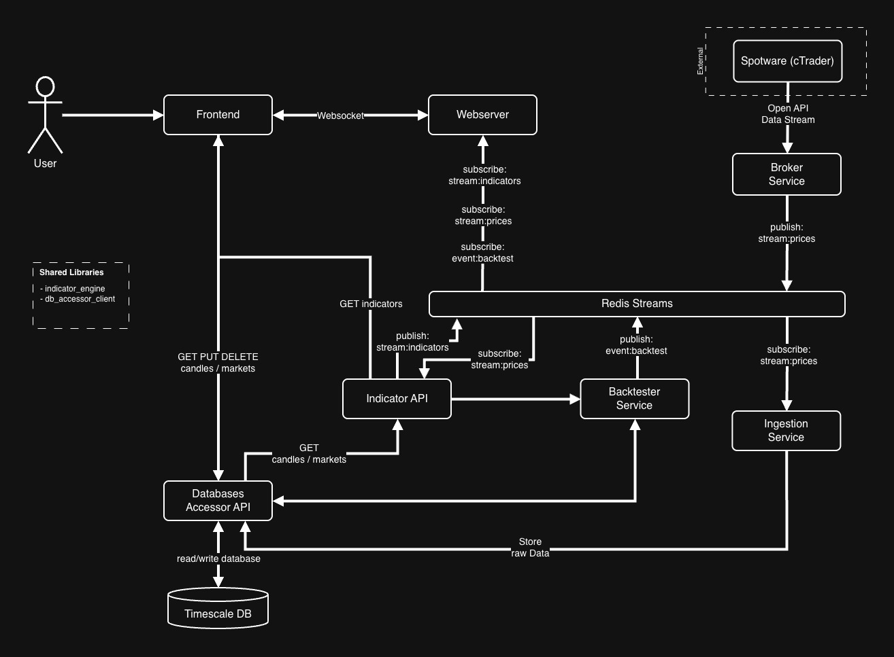

# AlgoTrader

AlgoTrader is an experimental trading project that uses the [Lightweight Charts](https://tradingview.github.io/lightweight-charts/) library to visualize historical market data.

## Local Node Architecture

This repository now runs as a local-development workspace with:

- `backend/`: unified Node.js trading backend built with Express and `ws`
- `frontend/`: existing Vue 3 + Vite client, adapted to the unified backend

The backend consolidates the former broker, indicator, ingestion, data-access, and gateway responsibilities into one local server with:

- REST APIs for accounts, orders, positions, trades, markets, candles, indicators, and backtests
- WebSocket streaming at `ws://localhost:5000/stream`
- synthetic market data generation for live candle and indicator updates
- persistent local JSON-backed storage under `backend/data/`

## Architecture


## Development Disclaimer

This project is in active development and may undergo significant changes. **Backward compatibility is not guaranteed**—things might break! Please use this repository **for reference only** and not as a stable library.

## Trading Risk Disclaimer

Trading in derivative instruments—including futures, options, CFDs, Forex, and
certificates—carries significant risk and may not be appropriate for all
investors. There is a possibility of losing the entire initial investment or even more. **Use this project at your own risk.**

## Support the Project

If AlgoTrader has helped you with your algorithmic trading journey, you can support its continued development by using my [IC Trading affiliate link](https://www.ictrading.com?camp=86158) when opening a trading account. IC Trading offers competitive spreads and reliable execution for algorithmic traders.

*Using this link costs you nothing extra but helps fund the development of new features and improvements.*

## Prerequisites

- Node.js 20+
- npm 10+

## Getting Started

1. Clone the repository:
   ```sh
   git clone https://github.com/s-stolz/algotrader.git
   cd algotrader
   ```
2. Create a local environment file:
   ```sh
   cp .env.example .env
   ```
3. Install dependencies:
   ```sh
   npm install
   ```
4. Run the backend and frontend together:
   ```sh
   npm run dev
   ```
5. Open the app at `http://localhost:5173`.

## Useful Commands

```sh
npm run dev
npm run dev:backend
npm run dev:frontend
npm run build
```

## Backend Highlights

- `GET /accounts`
- `POST /orders`
- `GET /positions`
- `POST /trade`
- `GET /api/data-accessor/markets`
- `GET /api/data-accessor/candles/:symbol?timeframe=M1`
- `GET /api/indicator-api/indicators`
- `POST /api/indicator-api/indicators/:indicatorId`
- `POST /api/backtest/run`

## WebSocket

The live stream endpoint is:

```txt
ws://localhost:5000/stream
```

Message types supported:

- `subscribeCandles`
- `unsubscribeCandles`
- `subscribeIndicator`
- `unsubscribeIndicator`
- `candleUpdate`
- `indicatorUpdate`
- `tradeUpdate`

## License

This project is licensed under the MIT License - see the [LICENSE](LICENSE) file for details.

This project makes use of third-party software so please check the [ATTRIBUTIONS.md](ATTRIBUTIONS.md) file for more information.
# paperTrading
# paperTrading
